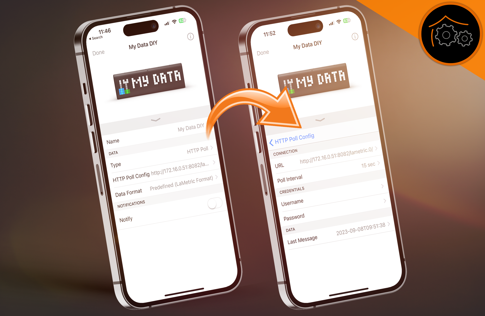

# ioBroker.lametric

*LaMetric* bietet (über den integrierten App-Store) eine zusätzliche App an, um eigene Informationen darzustellen. Diese App heißt [My Data DIY](https://apps.lametric.com/apps/my_data__diy_/8942). Dieser Adapter erstellt einen Datenpunkt im erforderlichen Format.

Seit Version 2.0.0 dieser App, können Daten auf unterschiedliche Weite an das Gerät übergeben werden.

- Push: der Adapter sendet die Daten regelmäßig an das Gerät (wenn diese sich ändern)
- Poll: die Daten von der *LaMetric Time* regelmäßig abgeholt (konfigurierbar)

Beide Methoden werden in diesem Dokument erklärt.

## My Data (DIY) - Push *(Adapter-Version >= 3.0.0 notwendig)*

*noch nicht implementiert*

## My Data (DIY) - Poll *(Adapter-Version >= 1.1.0 notwendig)*

Es können verschiedene Adapter genutzt werden, um die Daten zur *LaMetric Time* zu übertragen:

- Web Adapter (empfohlen) *(Adapter-Version >= 2.1.0 notwendig)*
- REST API Adapter
- Simple API Adapter

### Web Adapter (empfohlen)

```ioBroker LaMetric Adapter -> Zustand mit Frame-Informationen <- ioBroker Web Adapter <- My Data DIY App <- LaMetric```

1. Installiere den [Web ioBroker Adapter](https://github.com/ioBroker/ioBroker.web)
2. Erstelle eine neue Instanz des Web-Adapters (z.B. ``web.0``)
3. Konfiguriere den Port der neuen Web-Instanz (z.B. ``8082``)
4. Installiere die App *My Data DIY* über den App-Store auf Deiner *LaMetric Time*
5. Öffne die Einstellungen der *My Data (DIY)* App und konfiguriere die URL des REST API Adapters (siehe unten)
6. Gehe in die Adaptereinstellungen und füge neue Frames mit deinen eigenen Informationen hinzu (siehe nächster Abschnitt)
7. Vergiss nicht, die zuvor konfigurierte Web-Instanz auszuwählen!

HTTP Poll Config:

```
URL: http://172.16.0.219:8082/lametric.0/
```

### REST API Adapter

```ioBroker LaMetric Adapter -> Zustand mit Frame-Informationen <- ioBroker REST API Adapter <- My Data DIY App <- LaMetric```

#### Konfiguration (mit Authentifizierung)

1. Installiere den [REST API ioBroker Adapter](https://github.com/ioBroker/ioBroker.rest-api)
2. Erstelle einen neuen ioBroker-Nutzer mit dem Namen ``lametric`` und einem eigenen Passwort (z.B. ``HhX7dZl3Fe``)
3. Füge den neuen ``lametric``-Nutzer zur Gruppe ``users`` hinzu
4. Installiere die App *My Data DIY* über den App-Store auf Deiner *LaMetric Time*
5. Öffne die Einstellungen der *My Data (DIY)* App und konfiguriere die URL des REST API Adapters (siehe unten)
6. Gehe in die Adaptereinstellungen und füge neue Frames mit deinen eigenen Informationen hinzu (siehe nächster Abschnitt)

HTTP Poll Config:

```
URL: http://172.16.0.219:8093/v1/state/lametric.0.mydatadiy.obj/plain?extraPlain=true
Username: lametric
Password: HhX7dZl3Fe
```

**Ersetze die Beispiel-IP, -Port, -Benutzername und -Passwort!**

### Simple API Adapter

```ioBroker LaMetric Adapter -> Zustand mit Frame-Informationen <- ioBroker Simple API Adapter <- My Data DIY App <- LaMetric```

#### Konfiguration (mit Authentifizierung)

1. Installiere den [Simple API ioBroker Adapter](https://github.com/ioBroker/ioBroker.simple-api)
2. Erstelle einen neuen ioBroker-Nutzer mit dem Namen ``lametric`` und einem eigenen Passwort (z.B. ``HhX7dZl3Fe``)
3. Füge den neuen ``lametric``-Nutzer zur Gruppe ``users`` hinzu
4. Installiere die App *My Data DIY* über den App-Store auf Deiner *LaMetric Time*
5. Öffne die Einstellungen der *My Data (DIY)* App und konfiguriere die URL des Simple API Adapters (siehe unten)
6. Gehe in die Adaptereinstellungen und füge neue Frames mit deinen eigenen Informationen hinzu (siehe nächster Abschnitt)

HTTP Poll Config:

```
URL: http://172.16.0.219:8087/getPlainValue/lametric.0.mydatadiy.obj/?json&user=lametric&pass=HhX7dZl3Fe
```

**Wichtig: Nutze das json-Flag des SimpleAPI Adapters (verfügbar seit Version 2.6.2)**

**Ersetze die Beispiel-IP, -Port, -Benutzername und -Passwort in der URL!**

#### Konfiguration (ohne Authentifizierung)

1. Installiere den [Simple API ioBroker Adapter](https://github.com/ioBroker/ioBroker.simple-api)
2. Installiere die App *My Data DIY* über den App-Store auf Deiner *LaMetric Time*
3. Öffne die Einstellungen der *My Data (DIY)* App und konfiguriere die URL des Simple API Adapters (siehe unten)
4. Gehe in die Adaptereinstellungen und füge neue Frames mit deinen eigenen Informationen hinzu (siehe nächster Abschnitt)

HTTP Poll Config:

```
URL: http://172.16.0.219:8087/getPlainValue/lametric.0.mydatadiy.obj/?json
```

**Wichtig: Nutze das json-Flag des SimpleAPI Adapters (verfügbar seit Version 2.6.2)**

**Ersetze die Besipiel-IP und den -Port in der URL!**

### Frame Konfiguration

- Füge mit dem Plus-Button so viele Frames hinzu, wie Du möchtest
- Symbol: Wähle ein Symbol von der [offiziellen Webseite](https://developer.lametric.com/icons) und füge die ID in das Feld ein. **Wichtig: Nutze ein i (für statische Sybole) oder ein a (für animierte Symbole) als Präfix der ID (Beispiel: `i3389`)**
- Text: Tippe einen beliebigen anzuzeigenden Text ein. Du kannst Informatioenn aus Datenpunkten abfragem, indem Du deren ID in geschweifte Klammern angibst. An dieser Stelle wird dann der aktuelle Wert der Datenpunkte eingesetzt. (Beispiel: `{youtube.0.channels.HausAutomatisierungCom.statistics.subscriberCount} Subscribers`)
- Dauer: Legt fest, wie lange der einzelne Frame angezeigt werden soll (Standard = 5 Sekunden)

Beispielkonfiguration von einigen Frames:


### My Data DIY App-Konfiguration

Seit Version 2.0.0 der *My Data DIY* App können weitere Einstellungen vorgenommen werden.

- Type: "HTTP Poll"
- HTTP Poll Config
    - URL: *siehe oben (je nach Methode)*
    - Poll Interval: 15 Sek.
    - Username: *siehe oben (je nach Methode)*
    - Passwort: *siehe oben (je nach Methode)*


